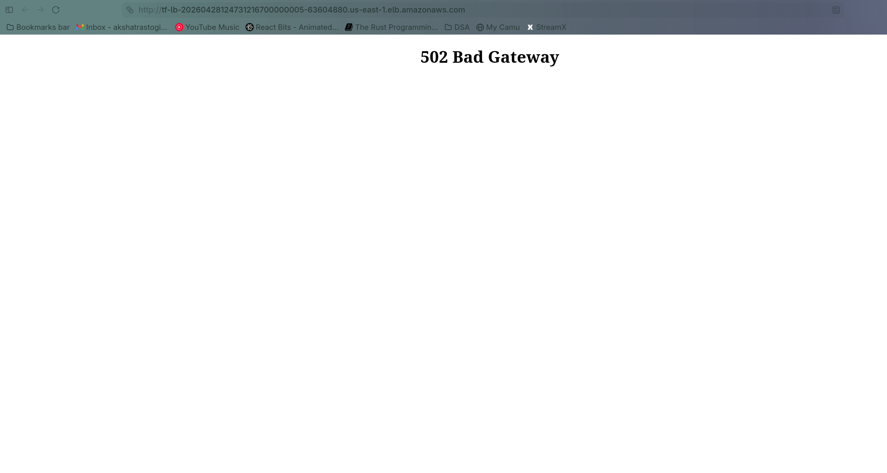

## Terraform Apply Output

```
Apply complete! Resources: 21 added, 0 changed, 0 destroyed.

Outputs:

alb_dns_name = "tf-lb-20260428194310732200000005-2073519939.us-east-1.elb.amazonaws.com"
private_subnet_ids = [
  "subnet-0884dfd80f4a9947b",
  "subnet-0ac75da6bf88945c9",
]
public_subnet_ids = [
  "subnet-0fa61ef5da77bd187",
  "subnet-07a03d5a93ac90042",
]
vpc_id = "vpc-0e2ec961afe040b41"

```


## After opening on browser


